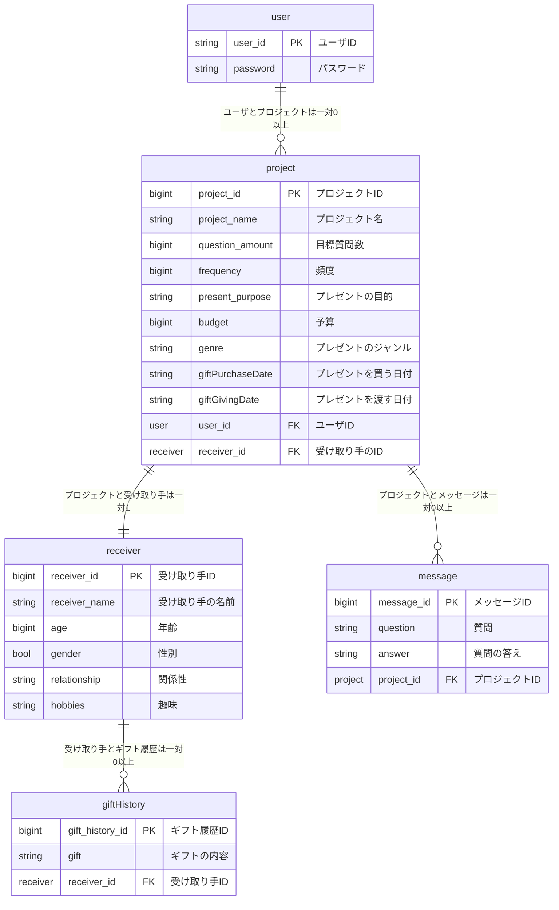

# upliftu
AIを活用して、相手の趣味や嗜好を自然に聞き出し、最適なプレゼントを提案します！

# 環境構築
プロジェクトをcloneする
```
git clone https://github.com/team-upliftu/UpliftU.git
```

# テストアプリの実行
```
cd sandbox/practice
npm install
npm run dev
```

# バックエンドの実行
```
cd project/backend/backend
python manage.py runserver
```

# ER図


# エンドポイントの定義
```
- user
POST /users
GET, PUT, PATCH, DELETE /users/{user_id}

- project
POST /projects
GET /projects
GET, PUT, PATCH, DELETE /projects/{project_id}

- receiver
POST /receivers
GET /receivers
GET, PUT, PATCH, DELETE /receivers/{receiver_id}

- hobby
POST /hobbies
GET /hobbies
GET, PUT, PATCH, DELETE /hobbies/{hobby_id}

- gift_history
POST /gift_histories
GET /gift_histories
GET, PUT, PATCH, DELETE /gift_histories/{gift_history_id}

- message
POST /messages
GET /messages (& project={project_id})
GET, PUT, PATCH, DELETE /messages/{message_id}
```