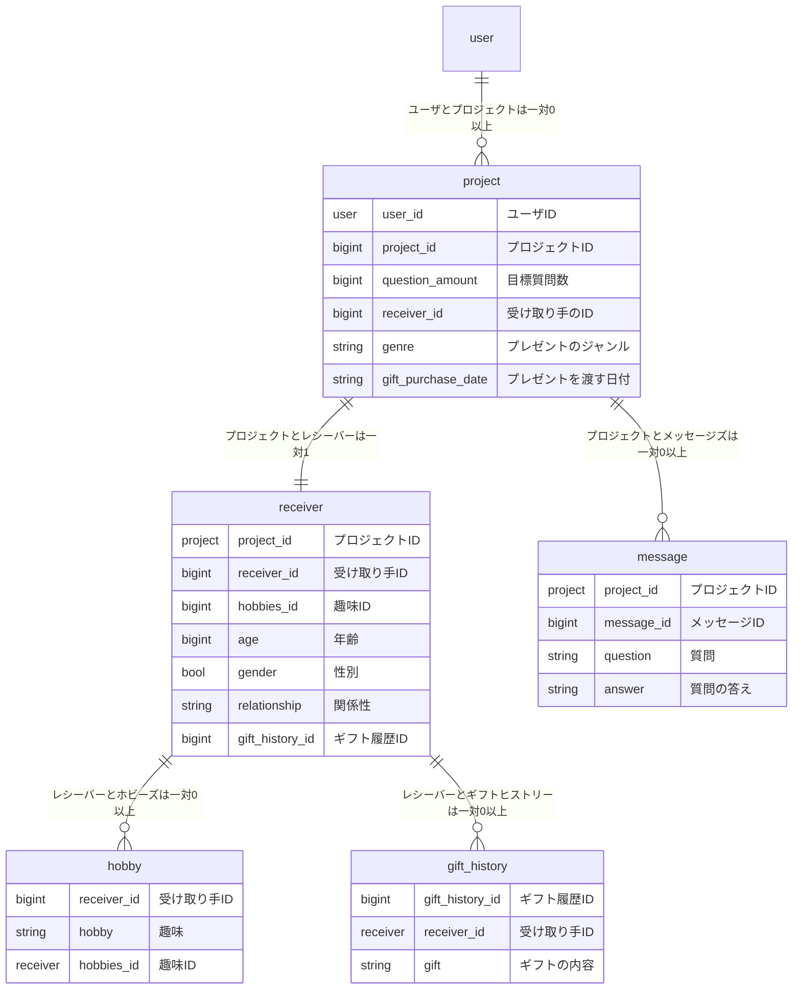

# upliftu
AIを活用して、相手の趣味や嗜好を自然に聞き出し、最適なプレゼントを提案します！

# 環境構築
プロジェクトをcloneする
```
git clone https://github.com/team-upliftu/UpliftU.git
```

# テストアプリの実行
```
cd sandbox/practice
npm install
npm run dev
```

# ER図
